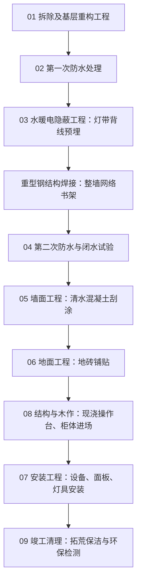

# 伏牛山居：全周期装修施工流程图

> **文档说明**：本文档为山居装修工程的标准化实务执行流程。各施工阶段的前置条件与逻辑不可逆转。执行时需严格遵守工序先后顺序，以避免返工或交叉污染。

## 📍 施工标准工序流程图 (Mermaid)

---

## 📋 各阶段标准操作节点 (与目录结构映射)

### 第一阶段：拆除与基层处理
**➡️ 关联目录：01，02**
1. **结构拆改 (`01-demolition-and-prep`)**
   - 确认建筑承重结构，拆除非承重墙体并进行旧墙剥离。
   - 将产生的建筑废料彻底清运。新建墙面对齐找平。
2. **第一次防水涂刷 (`02-first-waterproofing`)**
   - 在水电开槽前，在原楼板敷设初级防水涂层，作为防渗漏底线。

### 第二阶段：隐蔽管线与重型钢架工程
**➡️ 关联目录：03，04 及其钢架图纸**
3. **水暖电布线布点 (`03-mep-engineering`)**
   - 严格根据预设点位图切割线槽。敷设地暖管线（明确避开 24cm 进深的书架投影底部）。
   - **背部隐蔽光源**：由于书架背后需安装照射灯带，必须先完成墙面开槽与线管埋设，并在墙面预留好接头。
4. **重型钢结构焊接工程 (20×20热镀锌钢管整墙书架)**
   - **时序纠偏说明（根据 24cm 密集网眼设计调整）**：
      - *不可逆的操作空间*：书架网格极其密集且进深极浅，一旦被直接固定焊死，电工切面开槽机与手臂完全无法伸入其背后进行开槽与排线。因此，书架墙背面的隐蔽管线工作**必须先于钢架入场完成**。
      - *⚠️ 极高危防火警报*：正因为此刻地面与墙面的 PVC 穿线管已经布局完毕。电焊高达上千度的熔融飞溅物将是管线的致命威胁。**在焊接全周期，地面裸露管线、以及墙面预留的电线头，必须用地垫或防火石棉毯进行 100% 死角覆盖防护！**
5. **二次防水及闭水试验 (`04-second-waterproofing`)**
   - 管线与钢架地面膨胀孔钻击排布完成后，对所需区域涂刷强化防水。
   - 蓄水 48 小时进行漏点观测。

### 第三阶段：泥瓦硬装工程
**➡️ 关联目录：05，06**
6. **墙面清水工艺实操 (`05-diy-concrete-wall`)**
   - 以高环保地砖胶混合 325 标号低速初凝水泥（按 2:1 比例配比）。
   - 通过专用刮刀抹平等操作步骤，低成本实现清水混凝土工业风着色与墙面收边处理。
7. **地面找平与铺贴 (`06-tiling-and-flooring`)**
   - 泥瓦工进场进行地砖铺设作业。
   - 重点处理地面与水泥墙角交界处缝隙的收口工艺（防止后续起拱与渗透）。

### 第四阶段：大件定制与安装工程
**➡️ 关联目录：08，07** *(注：木作要在泥水粉尘作业后进场)*
8. **定制家具与现浇施工 (`08-concrete-and-wood-furniture`)**
   - 钢筋网骨架绑扎，支装立面模板，倒入自流平混凝土现浇成型厨房操作台。
   - 原木或定制木作板材运入场地，拼装并固定各类柜体。
9. **终端电器面板安装 (`07-lighting-and-installation`)**
   - 室内粉尘沉降后，安装所有主照明灯、书架层板灯带、插座面板与卫浴洁具龙头。

### 第五阶段：项目验收与环保监控
**➡️ 关联目录：09**
10. **清洁撤场 (`09-final-cleanup`)**
   - 工业吸尘器吸除全屋内所有残留的干结水泥块及粗粝木屑粉尘。
   - 使用专业设备测定甲醛扩散、TVOC 等数据，进行科学通风。工程正式交付。
